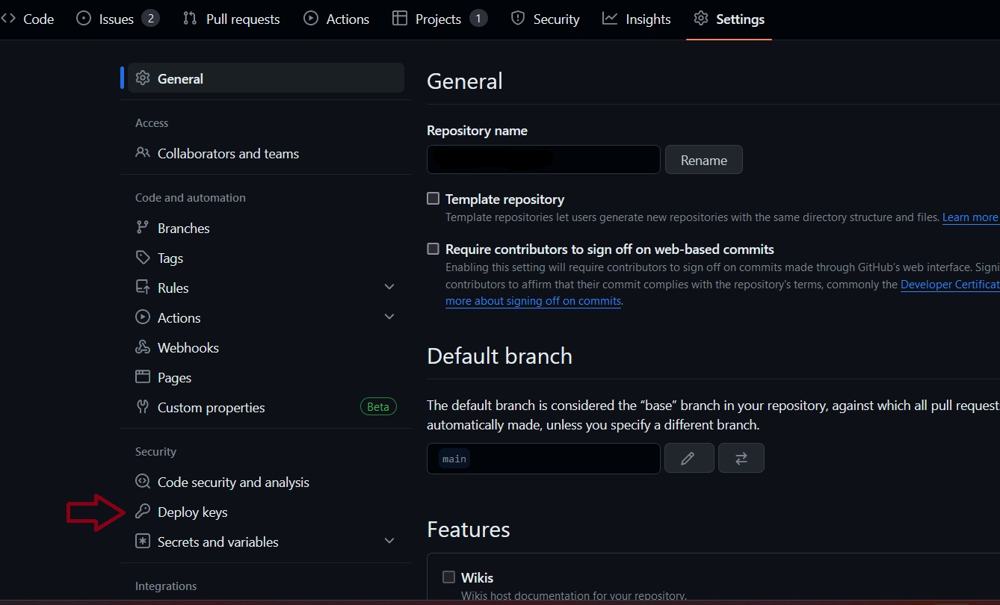
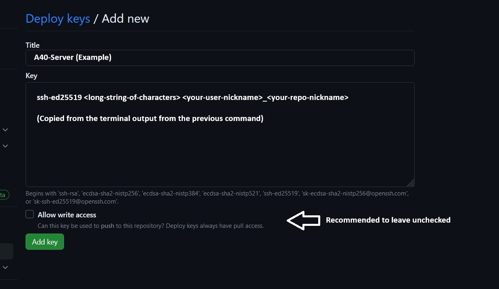

# UofS-KoLab (GitHub)
This organization is a comprehensive collection of projects undertaken by the current and graduated students of UofS KoLab under the supervision of Dr. Seokbum Ko.

Owner: Dr. Seokbum Ko (seokbum.ko@usask.ca)  
Maintainer: M. Hamis Haider (hamis.haider@usask.ca)  

## Table of contents
- [UofS-KoLab (GitHub)](#uofs-kolab-github)
  - [Table of contents](#table-of-contents)
  - [Deploying a repo on A40-Server](#deploying-a-repo-on-a40-server)
    - [1. Generating a deploy key](#1-generating-a-deploy-key)
    - [2. Adding the deploy key to your repo](#2-adding-the-deploy-key-to-your-repo)
    - [3. Cloning your repo](#3-cloning-your-repo)
  - [Manners \& Guidelines](#manners--guidelines)


## Deploying a repo on A40-Server
> [!NOTE]
> It is advised that you use read-only deploy keys on the a40 server.

### 1. Generating a deploy key
Once you've accessed the A40-server using Anydesk, open a terminal window and run the following command. An example of a user nickname could be `jodo` for `john doe`. An example of a repo nickname could be `tra_app` for `transformer approximations`:
```bash
ssh-keygen -t ed25519 -C "<your-user-nickname>-<your-repo-nickname>"
```
Eventually you'll see the following prompt:
```
> Enter a file in which to save the key (/home/YOU/.ssh/id_ed25519): /home/uofsko-lab/.ssh/id_<your-user-nickname>_<your-repo-nickname>
``` 

Next you'll be asked for a passphrase. 
```
> Enter passphrase (empty for no passphrase): [Type a passphrase]
> Enter same passphrase again: [Type passphrase again]
```
You can choose to leave it blank, but we encourage you to secure your key with a passphrase. 
> [!CAUTION]
> Save the passphrase at a secure place. You'll it need it later for push and pull requests to your github private repository. 

### 2. Adding the deploy key to your repo
1. After generating the deploy key. We must copy the public key and add it to the github repository that you wish to use on the A40-server. Run the following command to get the public key:
```bash
cat ~/.ssh/id_<your-user-nickname>_<your-repo-nickname>.pub
```
> [!WARNING]
> Do not forget to add the the `.pub` extension in the command above.

2. Copy **all** of the printed text from console. It would start with "ssh-ed25519" and end with "<your-user-nickname>_<your-repo-nickname>". Example:
```bash
ssh-ed25519 <long-string-of-characters> <your-user-nickname>_<your-repo-nickname>
```
3. Now log in to Github, and navigate to the settings page of your github repo. 
4. Click on **Deploy Keys** from the left-hand menu. 

1. Fill the form as shown and then press "Add Key".


### 3. Cloning your repo

## Manners & Guidelines
1. Cleanup after youself. Do regular cleanup of unnecessary materials and repositories in the organization.
2. Always open pull requests to merge into the default (main) branch of repos.
3. Always open issues to keep track of the project contributions and progress.
4. Use the github projects for task management sparingly.
5. Write device and os agnostic code wherever possible.
6. Write meangingful commit messages.
7. Always commit small changes and push. Big commits are harder to debug.
8. Ensure that project is in a "running" state locally before pushing to `dev` or `main` branch.